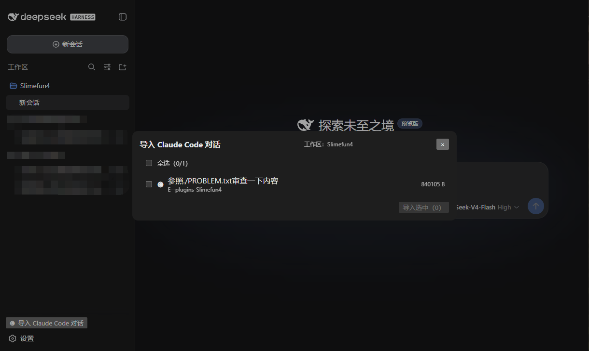
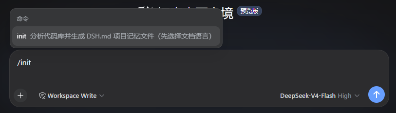

# dsh-cc-import

<strong>简体中文</strong> · <a href="README.en.md">English</a>

<p align="center">
  <a href="https://github.com/Mreate/dsh-cc-import"></a>
  <a href="https://github.com/Mreate/dsh-cc-import/stargazers"></a>
  <a href="https://github.com/Mreate/dsh-cc-import/forks"></a>
  <a href="https://github.com/Mreate/dsh-cc-import/actions"></a>
  <a href="LICENSE"></a>
  
  
</p>

> 把 Claude Code 的记忆与对话迁移进 DeepSeek Harness（DSH）：CLAUDE.md / DSH.md 记忆加载、
> `/init` 一键生成 DSH.md、Claude Code `.jsonl` 对话高保真导入为**可回溯、可 resume 的 DSH 会话**。
> 零核心改动，纯插件挂载。安装插件即可启用，卸载后不留任何核心补丁。

## 核心能力

- **记忆加载（CLAUDE.md + DSH.md）**：按 [Claude Code 官方文档](https://code.claude.com/docs) 的
  memory 层级注入 `~/.claude/CLAUDE.md`、`./CLAUDE.md`、`./CLAUDE.local.md`、子目录 CLAUDE.md 与
  `@import` 引用；同时加载本 harness 原生的 **DSH.md 家族**（`./DSH.md`、`./DSH.local.md`、子目录
  DSH.md 与 `@import`），DSH.md 后加载、冲突时优先级更高。
- **`/init` 命令**：输入 `/init` 先选择文档语言（中文 / English，DSH 选项选择 UI），
  再把「分析代码库 → 创建 DSH.md」的提示词提交给当前模型，由模型探索项目并写入
  `DSH.md`（参考 Claude Code 的 `/init` 流程；创建结果即时可见）。
- **对话高保真导入**：把 CC `.jsonl` 会话转换为可回溯、可 resume 的真实 DSH 会话
  （user/assistant 回合、工具调用与结果、thinking → `reasoning`、时间戳、token 用量），
  导入即**附加到当前工作区**。
- **子代理导入**：CC 子代理侧链（`<会话>/subagents/*.jsonl`）作为子会话导入
  （`parentSession` + `delegationDepth` + `origin: 'subagent'`）。
- **可扩展**：导入器实现 `ImportProvider` 接口（`src/import/provider.ts`），
  后续接 Cursor / Codex 等新 Agent 只需新增一个 provider 实现。
- **双入口**：侧边栏底部「🅒 导入 Claude Code 对话」按钮 + 浮层多选选择器；模型侧另有
  `cc_history_list` / `cc_import` 工具，模型也能直接驱动导入。

## 快速开始

前置条件：已全局安装 `dsh` CLI 的 DSH（`npm install -g @deepseek-ai/dsh`）、`pnpm` 10+、Node ≥ 22。

```sh
# 1. 克隆 / 下载本插件源码后安装依赖并构建
cd cc-import
pnpm install
pnpm run bundle        # tsdown → lib/index.js + lib/client.cjs

# 2. 装进 DSH profile（以 web 为例）
dsh plugin --profile web add <本插件绝对路径>
```

> 「declares no dsh.bundle — installed as a plain dependency」是正常的：
> 本插件走 `cordis.patch.yml` 的 insert 手动挂载，不走 bundle 层。

**接线（host 半）**：编辑 `~/.dsh/profiles/web/cordis.patch.yml`：

```yaml
- insert:
    - id: cc-import
      name: cc-import
```

**客户端半**由 `package.json` 的 `dsh.client` 字段自动发现打包，无需手动接线。
改完配置后重启 `dsh web`（浏览器页面自动重连，若客户端还是旧版刷新一次页面即可）。

## 界面

侧边栏底部新增「🅒 导入 Claude Code 对话」入口（DSH 官方 UI 无改动，纯插件叠加）：

| 区域 | 说明 |
|---|---|
| 底部入口 | 🅒 按钮，点击打开导入浮层 |
| 浮层顶栏 | 显示当前目标工作区（`工作区：<名称>`；检测不到时显示全部会话） |
| 会话列表 | 多选：CC 图标 + 标题（超 80 字自动折叠为灰色 `… (xx字已折叠)`）+ 项目目录 + 大小 |
| 批量导入 | 「导入选中（N）」→ 逐条结果（✓/✗ + 事件数 + 子代理数）→ 全部成功自动关闭浮层 |
| 列表过滤 | 只显示**当前工作区** cwd 匹配的 CC 会话（Windows 大小写/分隔符容错） |

## 效果截图

| 功能       | 截图                          |
|----------|-----------------------------|
| 导入对话 UI  |   |
| /init 指令 |    |

## 文档

| 主题 | 内容 |
| --- | --- |
| [设计文档](DESIGN.md) | 架构、事件映射、记忆层级、里程碑 |
| [接入清单](INTEGRATION.md) | 安装、接线、端到端验证步骤 |
| [代码约定](docs/conventions.md) | 模块边界、provider 抽象、lossless JSON 约定 |

## 配置与扩展

- **记忆层级**：CLAUDE 家族在前、DSH 家族在后（后者优先）；家族内 `local > project > user`、
  子目录 > 根目录；`@import` 支持 `@path`（相对引用文件所在目录）、`@/path`（工作区根）、
  `@~/path`（用户主目录），可嵌套、去环、深度有界。
- **`/init`**：先选语言（中文 / English）→ 生成「分析代码库并创建 DSH.md」提示词并
  提交给当前模型，由模型探索项目写入 `DSH.md`（已存在则建议改进）。
- **导入器扩展**：实现 `ImportProvider`（`discoverDataRoot` / `listSessions` / `previewSession` /
  `importSession`），在 `src/index.ts` 注册即可；`claude-code` 是参考实现。
- **工作区归属**：导入会话自动 `attachSession` 到目标工作区注册表，侧边栏按注册表分组
  立即出现在对应工作区下。

## 工作方式

```text
dsh profile
  -> dsh-base + dsh-web-app
  -> cc-import Cordis patch
  -> systemPrompt.context（CLAUDE.md + DSH.md 记忆，user-role 运行时上下文快照）
  -> /init 命令（语言选择 → userQuestions → agent.followup → 模型分析生成 DSH.md）
  -> 侧边栏 footer 按钮 + shell.overlay 浮层（客户端半）
  -> /api/cc-import RPC（webServer HTTP 路由）
  -> ImportProvider（CC JSONL 解析 + 事件合成）
  -> sessionPersistence.create/append（持久化）
  -> workspaceRegistry.attachSession（工作区归属帧）
  -> 客户端 session.list 基线重拉（立即出现，无需刷新浏览器）
```

导入只负责「把 CC 历史变成 DSH 会话」。会话日志是对话真源，resume、回溯、
工具执行、compaction 与持久化继续由 DSH 服务拥有。更详细的模块边界见
[设计文档](DESIGN.md)。

## 技术要点

- **事件级高保真映射**：CC 记录 → 平衡的 DSH `SessionEvent` 序列
  （`turn/start` → `user/message` → `step/start` → `assistant/message` →
  `tool/call` → `tool/result` → `step/end` → `turn/end`），`seq` 0 基连续、
  `time` 沿用源时间戳、surface 事件带 `surfaceOp: 'append'`、`data` 为 lossless JSON。
- **幂等导入**：确定性会话 id（`cc-<源文件名>`）让重复导入直接返回已有会话；
  会话被 DSH 归档后仍可重新导入——自动以 `cc-<源文件名>-reimport-N` 新建会话，原归档会话保留。
- **立即可见**：导入后 host 触发 `host/workspace-changed` 帧 + 客户端 `session.list`
  基线重拉，会话立刻出现在当前工作区，无需重启 DSH 或刷新浏览器。
- **Windows 路径容错**：cwd 过滤做大小写 / 分隔符归一化。
- **模型可驱动**：`cc_history_list` / `cc_import` 两个工具注册进模型工具集。

## 已知限制

- 工具调用参数与结果原样保留，但**不会被重新执行**——导入会话是忠实回放，不是在线重跑。
- 子代理已作为子会话导入，但主会话里触发子代理的工具调用尚未超链接到子会话。
- 附件（图片）还原未实现：CC 图片块降级为文本占位（`[image: <media_type>]`）。
- 侧边栏会话列表是 DSH 封闭区域，导入的会话在列表里无 CC 徽标（徽标只在插件浮层内显示）。
- 导入仅覆盖 `claude-code` provider；`@import` 深度/文件数有界（默认 4 层 / 40 个文件）。

完整已知限制与设计取舍见[设计文档](DESIGN.md)。

## 开发

CI 使用 Node 24 与 pnpm；包声明支持 Node `^22.19 || >=24`。

```sh
pnpm install --frozen-lockfile
pnpm run bundle
```

`pnpm run bundle` 会用 tsdown 把 `src/` 编译到 `lib/`（host：`lib/index.js`；
客户端：`lib/client.cjs`，工厂形式 `window.__ModuleLoader__.load`）。修改源码后
必须重新构建，重启 `dsh web` 生效。

## 权限与安全边界

`cc-import` 不实现独立沙箱：记忆加载只**读**文件；`/init` 与导入写入使用 DSH 现有
文件策略（`/init` 显式以 `workspace-write` 限定在当前工作区内）。对话导入落盘
`sessionPersistence` 并附加到工作区注册表，不执行任何模型或 Shell 命令。

## License

[MIT](LICENSE)
